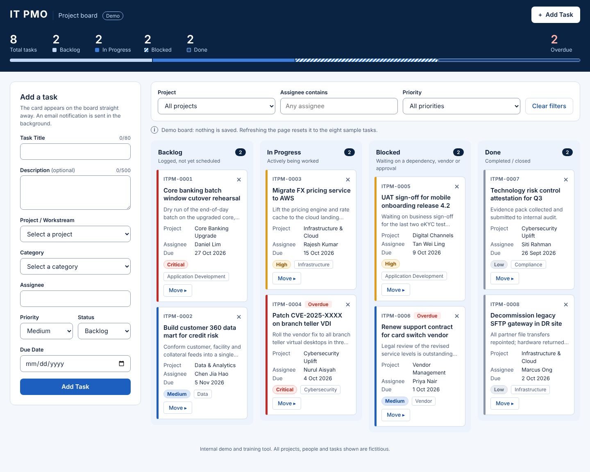

# IT PMO Kanban

[](https://github.com/yuloo79/test123/actions/workflows/deploy.yml)

A single-page Kanban board for a fictitious bank's IT project management office.
It is a demo and training tool: every project, person and task on it is made up,
and it is not connected to any real system.

**Live site:** https://yuloo79.github.io/test123/



## What it does

- Four fixed columns: Backlog, In Progress, Blocked, Done, each with a live task count.
- Drag cards between columns, or use the **Move ▸** button on a card to do the same from the keyboard.
- Cards show the task ID, title, project, assignee, due date, a priority pill and a category tag.
  The left border colour follows priority, and past-due tasks that are not Done get an **Overdue** badge.
- Delete a card with **×**, then confirm with the inline **Delete? Yes / No**.
- Add tasks from the form. Fields are validated in the page, with the error shown under the field.
- Filter by project, assignee (contains) and priority.
- The header shows total tasks, the count per column and the overdue count.

## Run it locally

There is nothing to install or build. Download `index.html` and double-click it.

The whole app is that one file: plain HTML, CSS and JavaScript, with no frameworks,
no CDN scripts, no fonts and no images.

## Nothing is saved

The board lives in memory only. Refreshing the page resets it to the eight sample
tasks. This is intended; the app uses no browser storage and no cookies.

## Email notifications (optional)

Adding a task can send an email through [FormSubmit](https://formsubmit.co).
It is off until you configure it.

1. Open `index.html` and find the first line of the `<script>` block:

   ```js
   const FORMSUBMIT_ENDPOINT = "https://formsubmit.co/ajax/YOUR_EMAIL@example.com";
   ```

2. Replace `YOUR_EMAIL@example.com` with the address that should receive the emails.
3. Add one task. FormSubmit sends a confirmation email to that address.
   Click the activation link in it. Tasks added after that are emailed.

Things to know:

- While the placeholder address is in place, the page sends nothing.
- If the email call fails, the card stays on the board and a warning appears.
- FormSubmit may reject requests from a page opened as a local file. Use the live
  site, or set `FORMSUBMIT_PAGE_URL` (the line below the endpoint) to the page's address.
- This repository is public, so an address you commit here is public too.

Other settings sit next to the endpoint: `TASK_ID_PREFIX` (task IDs look like
`ITPM-0009`), `EMAIL_SUBJECT_TAG` and `FORMSUBMIT_TIMEOUT_MS`.

## Checks and deployment

Every push and pull request runs [`.github/workflows/deploy.yml`](.github/workflows/deploy.yml):

1. **Secret scan.** [gitleaks](https://github.com/gitleaks/gitleaks) scans the full commit history.
2. **Page checks.** [`.github/scripts/check-page.mjs`](.github/scripts/check-page.mjs) confirms `index.html`
   is still self-contained: no external resources, no browser storage, no native
   dialogs, one `FORMSUBMIT_ENDPOINT` constant, and JavaScript that parses.
3. **Deploy.** On `main` only, and only if the first two pass, `index.html` is published to GitHub Pages.
   Nothing else in the repository is served.

Run the page checks yourself with:

```sh
node .github/scripts/check-page.mjs
```

## Claude Code setup

The repository carries project-level settings for [Claude Code](https://claude.com/claude-code):

- **`/deploy-github <repo-url>`** (`.claude/commands/deploy-github.md`) scans for sensitive data,
  updates this README and its screenshot, the workflow, GitHub Pages and the repository's
  About section, then pushes.
- **`frontend-design`** and **`high-end-visual-design`** (`.claude/skills/`) are design skills
  adapted to this board. They hold its design tokens, fixed rules and interface wording, so
  changes to the look stay consistent. They are based on
  [anthropics/skills](https://github.com/anthropics/skills) and
  [leonxlnx/taste-skill](https://github.com/leonxlnx/taste-skill); each folder keeps its licence.
- **`web-design-guidelines`** (`.claude/skills/`) audits `index.html` for accessibility, focus,
  forms, motion, touch and copy, using the
  [Vercel Web Interface Guidelines](https://github.com/vercel-labs/web-interface-guidelines)
  from [vercel-labs/agent-skills](https://github.com/vercel-labs/agent-skills), filtered
  through this board's fixed rules. Ask Claude to "review the UI".
- **`security-scanner`** (`.claude/agents/`) is a subagent that scans the page, the CI workflow
  and the repo config for vulnerabilities, classifies each one by severity, CWE and OWASP
  category, recommends fixes that respect the fixed rules, and writes a Word report to
  `security-reports/` (git-ignored). Ask Claude to "run the security scanner".
- **Playwright MCP** (`.mcp.json`) gives a session a browser for screenshots and checks.
  It is set up for Windows and Microsoft Edge: it starts through `cmd /c npx` and opens Edge.
  On macOS or Linux, change `command` to `npx` and drop the `/c` and `--browser msedge` arguments.

## Limits

- No persistence, no accounts, and no sharing between browsers.
- Drag and drop uses the browser's native API, which most touch screens do not support.
  Use **Move ▸** on phones and tablets.
- Email delivery depends on FormSubmit, a third-party service.
